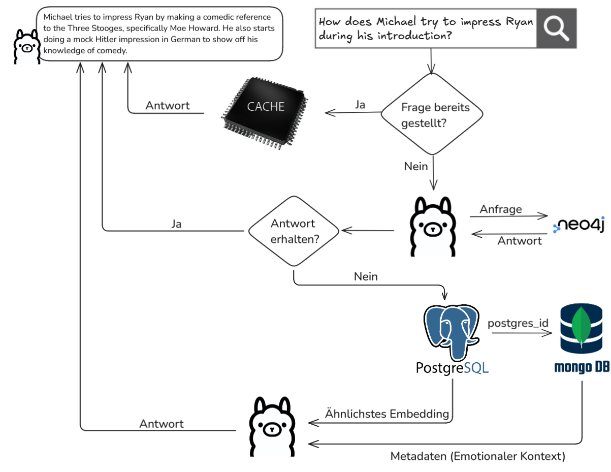

# The Office Chatbot
## Chatbot structure

## Data insertion

## Getting Started
1. make sure ollama 3.1:8b & mxbai-embed-large:latest are installed locally
2. <code>docker-compose up -d</code> 
3. <code>python3 -m venv .venv </code>
4. <code>source .venv/bin/activate</code>
5. <code>cd code </code> 
6. <code>pip install -r requirements.txt </code>
7. <code>python3 database_insert.py</code> (transcripts are not inserted because video fie is not included)
8. <code>streamlit run /home/path/to/office-chatbot/code/office_chatbot.py</code> start chatbot

## Note
You can change how many character statements are inserted in "database_insert.py" by changing the value of "last_line" parameter.